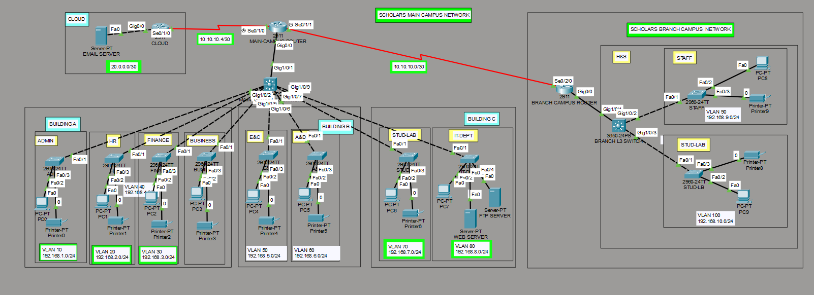

# Enterprise-Network-Topology-Cisco
Multi-Campus University Enterprise Network Topology Simulation using Cisco Packet Tracer
## Enterprise Network Architecture Diagram

## Overview
A secure and scalable multi-campus university enterprise network architecture simulated using Cisco Packet Tracer.

### Key Features & Configurations:
- **Logical Network Segmentation:** Implemented multiple VLANs (HR, Finance, IT Dept, Student Labs) to restrict broadcast domains and enforce security boundaries.
- **Inter-VLAN Routing:** Configured Layer 3 Multilayer Switches (`Cisco 3650`) to enable efficient inter-departmental communication.
- **WAN & IP Subnetting:** Configured point-to-point WAN serial links using `/30` subnets between the Main Campus and Branch Campus routers.
- **Core Infrastructure Services:** Integrated Enterprise Servers including Web, FTP, and Email Servers with external ISP/Cloud simulation.
